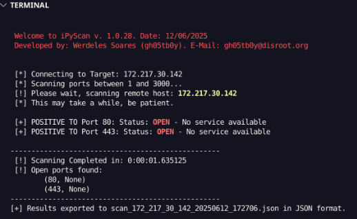

[](https://dl.circleci.com/status-badge/redirect/gh/werdelesmarcio/iPyScan/tree/main) [](https://codeclimate.com/github/werdelesmarcio/iPyScan/maintainability) [](https://ci.appveyor.com/project/werdelesmarcio/iPyScan) [](https://sonarcloud.io/summary/new_code?id=werdelesmarcio_iPyScan) [](https://sonarcloud.io/summary/new_code?id=werdelesmarcio_iPyScan) [](https://sonarcloud.io/summary/new_code?id=werdelesmarcio_iPyScan)   

# iPyScan (Version 1.0.26)
Trata-se de uma aplicação voltada principalmente para sistemas **GNU/Linux** _(embora o interpretador Python 3 no Windows também execute a aplicação normalmente)_, com o objetivo de realizar a varredura de portas. A aplicação verifica quais portas estão abertas em um intervalo de portas fornecido por argumentos, retornando **OPEN** em caso positivo.
Os argumentos fornecidos consistem no endereço do host ou IP do alvo a ser analisado, seguido do intervalo de portas inicial e final.
   
   > OBS.: Se o objetivo for escanear apenas uma porta, basta fornecer o mesmo valor para os dois últimos parâmetros.

## Estrutura do projeto:
```
iPyScan/
│
├── utils/
│   ├── __init__.py          # Torna utils um pacote Python
│   ├── banner.py            # Contém a função banner()
│
├── scanner/
│   ├── __init__.py          # Torna scanner um pacote Python
│   ├── input_validation.py  # Contém validação de argumentos
│   ├── network_utils.py     # Contém as funções de rede como `connect` e `resolve_target`
│   ├── port_scanner.py      # Contém a função de escaneamento `scan_ports`
│
├── main.py                  # Arquivo principal que faz a execução do código
└── README.md                # Descrição do projeto (opcional)
```

## Funcionalidades
Estas são as instruções para obter uma cópia do iPyScan em sua máquina para fins de desenvolvimento ou uso:
1. Faça o download ou clone o repositório em sua máquina e descompacte-o no local de sua preferência.
   - Não é necessário instalar o iPyScan.
   - Se for utilizá-lo como executável, lembre-se de conceder permissão de execução (caso esteja usando uma distribuição GNU/Linux).
   - O sistema foi ajustado para garantir funcionalidade multiplataforma.
2. Para executar o projeto, atente-se às seguintes dependências:
   - Ter o interpretador Python, versão 3.xx, e o pip3 instalados em sua máquina.
   - Instalar as dependências listadas no arquivo requirements.txt.
   - Se estiver utilizando uma distribuição Linux, recomenda-se realizar o update e o upgrade do sistema antes de rodar o projeto.

## Permissões (usuários GNU/Linux)
```powershell
# Para dar permissão de execução.
sudo chmod +x ipyscan.py
```

## Rodando localmente
```powershell
# Clone o projeto
  git clone https://github.com/werdelesmarcio/iPyScan.git

# Entre no diretório do projeto
  cd iPyScan

# Instale as dependências
  pip3 install requirements.txt

# Inicie a aplicação. Para executar a aplicação deve passar o argumento com o host do alvo, a porta inicial e a porta final. 
# Linux
  python3 ipyscan.py [target] [init_port] [final_port]

# Windows
  python3.exe ipyscan.py [target] [init_port] [final_port]
```

## Screenshot


## Melhorias
1. Modularização por responsabilidade: Cada módulo contém funções que desempenham tarefas específicas:
   - banner.py: Apenas exibe o banner.
   - input_validation.py: Valida os argumentos de entrada.
   - network_utils.py: Funções relacionadas a redes (conexão e resolução de nomes).
   - port_scanner.py: Função que executa o loop de escaneamento.
2. Facilidade de manutenção: Agora o código está dividido em partes menores e mais fáceis de gerenciar. Se houver alguma mudança na lógica de rede, por exemplo, ela ficará confinada ao arquivo network_utils.py.
3. Reuso de código: Caso queira usar o código de conexão em outro projeto, basta importar o módulo adequado (network_utils) sem precisar alterar o código principal.
4. Legibilidade: Com funções bem definidas e módulos organizados, o código se torna mais legível e fácil de entender para outras pessoas que venham trabalhar nele.
   
   > Agora, cada arquivo é responsável por uma parte do código, o que melhora bastante a organização do projeto!

## Licença
Este projeto está sob Licença GPL-3.0. Para mais informações, consulte a documentação de licença no link abaixo.
   - [GPL-3.0](https://choosealicense.com/licenses/gpl-3.0/)

## Colaboradores
Um praise para os cúbicos que contribuíram neste projeto 👏
<div align=center>
<table border="0px">
  <tr>
    <td align="center"><a href="https://github.com/werdelesmarcio"><br /><b>Werdeles Soares</b></a><br /><sub>💻 Desenvolvedor</sub></td>
    <td align="center"><a href="https://github.com/fabi-goncalves"><br /><b>Fabi Gonçalves</b></a><br /><sub>👨‍💻 Colaboradora</sub></td>    
    <td align="center"><a href="https://github.com/matholiveira91"><br /><b>Matheus Oliveira</b></a><br /><sub>👨‍💻 Colaborador</sub></td>
  </tr>
</table>
</div>

## Como contribuir para o projeto
Caso tenha alguma dúvida confira este [guia de como contribuir no GitHub](./CONTRIBUTING.md)

## Contatos
Se quiser entrar em contato, crie um **issue** no GitHub ou envie um e-mail para gh05tb0y@disroot.org. Obrigado!

[](<[https://www.linkedin.com/](https://www.linkedin.com/in/werdeles-soares/)>)
 


